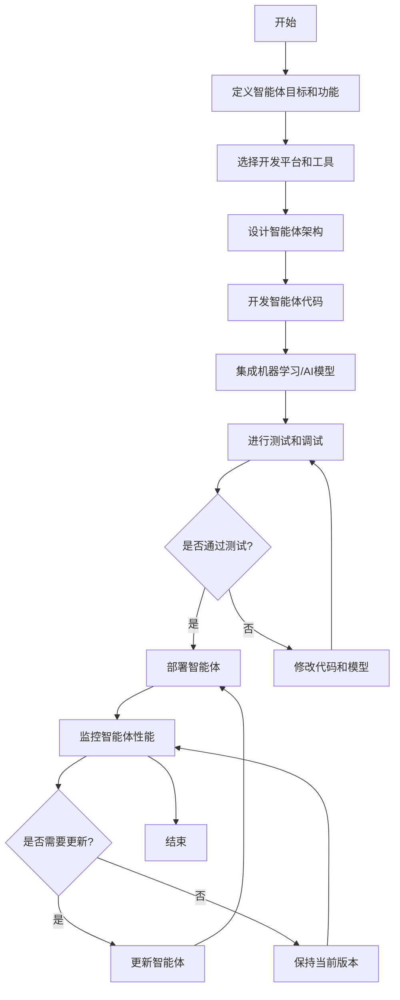

```mermaid
graph TD
    A[开始] --> B[定义智能体目标和功能]
    B --> C[选择开发平台和工具]
    C --> D[设计智能体架构]
    D --> E[开发智能体代码]
    E --> F[集成机器学习/AI模型]
    F --> G[进行测试和调试]
    G --> H{是否通过测试?}
    H -->|是| I[部署智能体]
    H -->|否| J[修改代码和模型]
    J --> G
    I --> K[监控智能体性能]
    K --> L{是否需要更新?}
    L -->|是| M[更新智能体]
    M --> I
    L -->|否| N[保持当前版本]
    N --> K
    K --> O[结束]
```